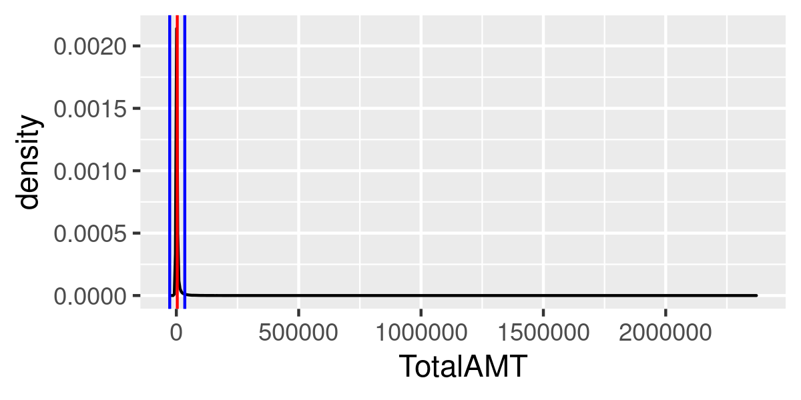
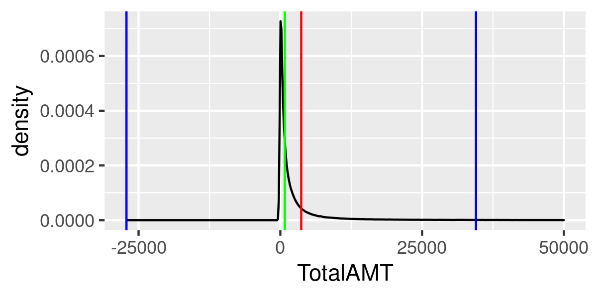

## Setup

We are going to discuss a couple of different data sets and a couple of different ideas tonight.

```{r setup, include=FALSE}
rm(list = ls())
library(modelr)
library(tidyverse)
options(scipen=999)
data(diamonds)
```

# Measures of Centrality

## Height of Adult Women

- The mean (average) and median are the two most common methods for summarizing the central tendency of a data set.
    - This is not a problem, simply an observation of reality.
- The example below is from an R data set of heights of women.
    - This data set contains merely 15 rows of data and should not be treated as canonical.
- That said, it is a great example of an average tells us something meaningful about the data.
    - The black line is the density plot. Remember, the area under a density plot = 1.
    - The average height is marked in red.
    - The blue lines are for the average +/- twice the standard deviation. These are our 95th percentile markers.
    - This looks good. Really. It does.

```{r}
data(women)
avg_height <- mean(women$height/12)
sd_height <- sd(women$height/12)

ggplot(women, aes(height/12)) +
  geom_density() +
  geom_vline(aes(xintercept = avg_height), color = "red") +
  geom_vline(aes(xintercept = avg_height + 2 * sd_height), color = "blue") +
  geom_vline(aes(xintercept =  avg_height - 2 * sd_height), color = "blue")
```

## Insurance Claims Cost

- The code I wrote to perform this analsis is in this repo, but the raw data is not.
    - claims2018.sql The SQL I wrote to export the data from our EDW.
    - claims2018.R: Imports the data from CSV and calculates the average, etc.
- I cannot share this data with you because it (obviously) contains PHI.
    - This data is from 2018, avoiding all impact from Covid, etc.
    - Members are people living here in the Capital District and surrounding counties.
        - I am not at liberty to be any more precise than that.
    - With a few exceptions, all claims are included.
        - This data set excludes certain claim types which are extra sensitive including some HIV treatments, certain mental health diagnoses, etc.
    - And what do we find? **CRAZINESS!**

```{r}

```

- Colors have the same meaning as before however, our average is not even remotely close to the center of our plot.
    - Some people are really, really expensive.
- Anytime your 95% confidence interval includes impossible numbers, you probably have a problem.
    - There are women shorter than 5 feet tall.
    - Not counting some funkiness around deductions spanning calendar years and what not, people do not have less than $0 healthcare costs.
        - Says the guy who hasn't seen his PCP in . . . ? years . . . do I even have a PCP? Hmm. I should know the answer to that question.

Let's "zoom in" on just those patients with less than $50,000 in 2018 costs and include the median, because the median is more resistant to outliers, right?

- Well, maybe? Our upper limit on the 95% confidence interval is ~$34,500.
- Would any of you want to argue that the red line is representative of the center of the data?
- And even the median isn't actually all that great (although it _is_ much better).

```{r}

```

- This average is mathematically, the average. It isn't "wrong" but I would argue it isn't very meaningful.
- Moreover, the median, while better, is also a little weird.
- And no single summary number, no matter how brilliantly conceived can express the long-tail of this distribution.
    - A picture really is worth a thousand measures of central tendency.
    - Because while true, I still think it is misleading to say the median cost was 784 dollars, simply because so many people spent SO MUCH LESS.
         - In truth, MOST PEOPLE spent less.


# Linear Regression

**Question:** Can we predict the price of a diamond?
**Answer:** Yes, but it is a little harder than you might expect.

And just in case you haven't been reading the book, [tonight's lecture looks very similar to a chapter in our book](https://r4ds.had.co.nz/model-building.html).

Given the data below, we will develop a model to predict the price of a diamond.

```{r}
diamonds
```

- At first, this seems like it should be easy, but things are not quite as simple as they appear to be.
- In the graphs below, be aware: 
    - The worst diamond color is J (slightly yellow). 
    - The worst clarity is I1 (inclusions visible to the naked eye).

```{r}
ggplot(diamonds, aes(cut, price)) + geom_boxplot()
ggplot(diamonds, aes(color, price)) + geom_boxplot()
ggplot(diamonds, aes(clarity, price)) + geom_boxplot()
```

This is . . . . odd? It would seem that crappy diamonds cost more than good diamonds . . . . because of course they do. Maybe.

```{r}
## This draws a hex-scatter plot and rather than count each individual diamond
## separately, it creates a number of bins (N) across the x and y axis and then
## reports how many cases (diamonds) are in each bin.
ggplot(diamonds, aes(carat, price)) + 
  geom_hex(bins = 50)
```

- Ahhhhhhhhh. Carat.
- The WEIGHT/SIZE of the thing matters more than anything else. 
- And, side-note, that ain't a linear relationship.
- Which makes sense, because you can see that beyond two carats, there are fewer and fewer diamonds for sale at that weight.
- And if ~2 is a big diamond, it stands to reason that it might start to have quality problems.

**Question:** So, how do we handle non-linear relationships?
**Answer:** We log the hell out of them!

- The linear model assumes a linear relationship between the dependent (price) and independent variable (carat).
- And we can see this is not even remotely true.
- To deal with this, we can do two things:

- Focus on diamonds smaller than 2.5 carats (99.7% of the data)
- Log-transform the carat and price variables.

```{r}
diamonds <- 
  diamonds %>%
  filter(carat <= 2.5) %>%
  mutate(lprice = log2(price),
         lcarat = log2(carat))
```

- We don't have time to fully unpack what a logarithm is and how it normalizes our data, so if you would like to take a deep dive into that topic: https://www.youtube.com/watch?v=cEvgcoyZvB4
- But I do want to prove to you that it works.

```{r}
ggplot(diamonds, aes(price)) + geom_density()
ggplot(diamonds, aes(lprice)) + geom_density()
```

- Please note that the SHAPE of the resulting data would be the same regardless of which log we used. 
- Common options here include natural log (`log()`), base-2 log (`log2()`), and base-10 log (`log10()`).
- Feel free to play with this code to prove this to yourself.
- Whew, while it is still multi-modal (because the underlying data is), it does remove our skew.

```{r}
## Same plot as before, this time using logged data.
ggplot(diamonds, aes(lcarat, lprice)) + 
  geom_hex(bins = 50) +
  geom_point() +
  geom_smooth(method = "lm")
```